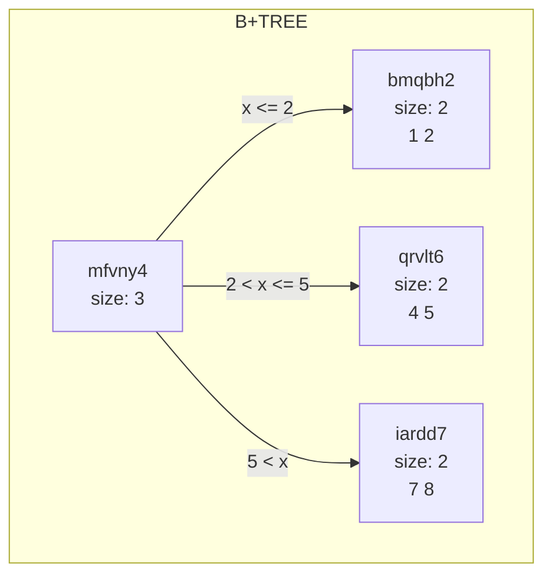
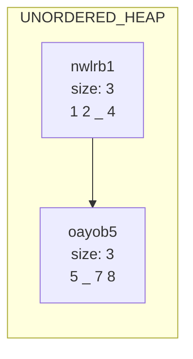

```mermaid
graph TD
subgraph B+TREE
mfvny4[mfvny4<br/>size: 3<br/>]
bmqbh2[bmqbh2<br/>size: 2<br/>1 2 ]
mfvny4-->|x <= 2|bmqbh2
qrvlt6[qrvlt6<br/>size: 2<br/>4 5 ]
mfvny4-->|2 < x <= 5|qrvlt6
iardd7[iardd7<br/>size: 2<br/>7 8 ]
mfvny4-->|5 < x|iardd7
end
```

```mermaid
graph LR
subgraph UNORDERED_HEAP
nwlrb1[nwlrb1<br/>size: 3<br/>1 2 _ 4 ]
oayob5[oayob5<br/>size: 3<br/>5 _ 7 8 ]
nwlrb1-->oayob5
end
```
